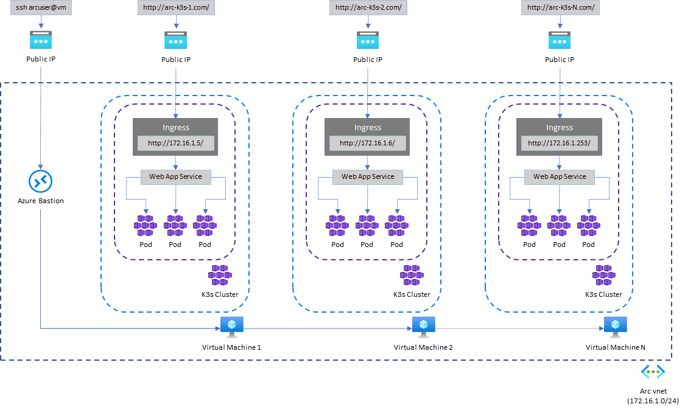

# Deploying and Managing Apps at Scale on Azure Arc-enabled Kubernetes with GitOps

[Azure Arc-enabled Kubernetes](https://docs.microsoft.com/en-us/azure/azure-arc/kubernetes/overview) allows you to attach and configure Kubernetes clusters running anywhere. You can connect your clusters running on other public cloud providers (such as GCP or AWS) or clusters running on your on-premises data center (such as VMware vSphere or Azure Stack HCI) to Azure Arc.

When you connect a Kubernetes cluster to Azure Arc, it will:

- Be represented in Azure Resource Manager by a unique ID
- Be placed in an Azure subscription and resource group
- Receive tags like any other Azure resource

Azure Arc-enabled Kubernetes supports industry-standard SSL to secure data in transit. For the connected clusters, cluster extensions, and custom locations, data at rest is stored encrypted in an Azure Cosmos DB database to ensure confidentiality.

## Using GitOps with Flux v2 and Azure Arc-enabled Kubernetes clusters

Managing infrastructure at scale has always been a challenge, specially when resources are spread geographically with different and unique environment constraints. [Azure Arc](https://docs.microsoft.com/en-us/azure/azure-arc/overview) helps with the visibility and governance of servers, databases and Kubernetes clusters. They appear in the Azure portal, collect metrics through Azure Monitor and are governed by Azure Policies, as if they were any other Azure resource.

Traditionally, CI/CD practices for containerized apps and microservices utilize a push philosophy: whenever there is a change in one of your applications, a new Docker image is built and pushed to a container registry, and the new image version is then deployed to Kubernetes either via manifests or charts like Helm. This model becomes too rigid when one is supposed to deploy the same application at scale, and that is what the GitOps paradigm solves: GitOps treats each software or infrastructure component as one or more files in a version control system (Git, Bucket), with an automated process to syncrhonize state between the version control and the runtime environment. This is a radical change because it allows IT teams to use infrastructure-as-code (IaC) with the same version control processes that developers have used for decades, adding consistency and standardization to infrastructure management at scale. Since Kubernetes provide the concept of immutability and resource definition in a declarative way, it is much easier to put measures to prevent configuration drifts compared to traditional VM-based deployments. Tools like [Flux](https://fluxcd.io/docs/) and [Argo CD](https://argo-cd.readthedocs.io/en/stable/) run on this principle, establishing a single source of truth (a version control system) for all application and infrastructure deployments. Additionally, they implement a pull method (as opposed to pushing a manifest or charts to a cluster), making it much easier to target multiple clusters regardless of their physical locations.

This repo will help you understand how you can deploy applications at scale using Azure Arc-enabled Kubernetes and Flux v2. The following steps describe what is done by the deployment wizard:

1. It creates one or more Ubuntu Azure Virtual Machines

2. Installs the lightweight version of [Rancher K3s](https://k3s.io/) on each VM

3. Installs the Azure Arc agent on each cluster

4. Installs the following Microsoft Kubernetes extensions on each cluster: `Policy Insights`, `Azure Defender for Kubernetes`, `Azure Monitor for Containers`

5. Installs the `Microsoft.flux` extension on each cluster

6. Creates a [Flux configuration](https://docs.microsoft.com/en-us/cli/azure/k8s-configuration/flux?view=azure-cli-latest) to manage all the required Helm release sources (in the form of `HelmRepository` objects)

7. Creates a [Flux configuration](https://docs.microsoft.com/en-us/cli/azure/k8s-configuration/flux?view=azure-cli-latest) to manage the cluster infrastructure, including an [NGINX](https://github.com/kubernetes/ingress-nginx) Ingress controller and [Stakater Reloader](https://github.com/stakater/Reloader)

8. Creates a [Flux configuration](https://docs.microsoft.com/en-us/cli/azure/k8s-configuration/flux?view=azure-cli-latest) to manage a web application

9. Creates a [Flux configuration](https://docs.microsoft.com/en-us/cli/azure/k8s-configuration/flux?view=azure-cli-latest) to manage the state of the web application

> **NOTE**: This repository is a more compact version of the [Azure Arc Jumpstart](https://azurearcjumpstart.io/azure_jumpstart_arcbox/) project, which provides sandbox environments for IT Pros and Developer audiences. If you are looking for a broader approach and more use cases to learn Azure Arc, definitely check out the amazing work they have done and come back here when you want to focus more on the GitOps side of the story.

> **NOTE:** If you are wondering how to run this in your production environments, check out [AKS Edge Essentials](https://learn.microsoft.com/en-us/azure/aks/hybrid/aks-edge-overview), our offering to run Azure Managed Kubernetes on PC-class devices.

### Architecture

the image below illustrates the resources that are deployed and how they are configured:



### Flux Configurations

Probably the most important part of a successful GitOps implementation, is the repository and folder structure for all the components that will be managed via GitOps. The snippet below shows the repository tree after you have run the solution:

```textile
gitops-playground/
├── app-settings
│   └── edge-app
│       ├── kustomization.yaml
│       ├── namespace.yaml
│       └── release.yaml
├── apps
│   ├── edge-app
│   │   ├── kustomization.yaml
│   │   ├── namespace.yaml
│   │   └── release.yaml
│   └── kustomization.yaml
├── clusters
│   ├── k3s-<uniqueId>-<clusterIndex>
│   │   ├── edge-app-settings
|   │   │   ├── kustomization.yaml
|   │   │   └── release-patch.yaml
│   │   └── infrastructure
|   │       ├── kustomization.yaml
|   │       └── release-patch.yaml
│   ...
├── infrastructure
│   ├── ingress-nginx
│   │   ├── kustomization.yaml
│   │   ├── namespace.yaml
│   │   └── release.yaml
│   └── stakater-reloader
│       ├── kustomization.yaml
│       ├── namespace.yaml
│       └── release.yaml
└── sources
    ├── edge-app-settings.yaml
    ├── edge-app.yaml
    ├── ingress-nginx.yaml
    ├── kustomization.yaml
    └── stakater-reloader.yaml
```

Here is a brief description of each section:

- `sources` folder: It contains [HelmRepository](https://fluxcd.io/docs/components/source/helmrepositories/) objects that will be used in the solution. The `HelmRepository` resource specifies the location of a [Helm Chart](https://helm.sh/). Charts can be stored at an OCI Helm repository (like [like Azure Container Registry](https://docs.microsoft.com/en-us/azure/container-registry/container-registry-image-formats#oci-images)) or an HTTP/HTTPS repository like Git.

- `apps` folder: It contains the [HelmRelease](https://fluxcd.io/docs/components/helm/helmreleases/) definition for each app that will be deployed as part of the same GitOps configuration. If you want to add a new app to it, create a new folder with the respective release files and include it in the ```kustomization.yaml``` file.

- `app-settings` folder: It contains the generic `HelmRelease` definition for the Kubernetes objects (ConfigMap and Secrets) that manage the state of each application. Later we explain how this release is merged to provide a unique state to each cluster.

- `infrastructure/ingress-nginx` folder: It contains the `HelmRelease` definition for the Ingress Controller.

- `infrastructure/stakater-reloader` folder: It contains the `HelmRelease` definition for the [Reloader](https://github.com/stakater/Reloader). In this sample solution the reloader automatically recreates the pods of a deployment every time a ConfigMap or Secret changes.

- `clusters/k3s-<uniqueId>-<clusterIndex>` folders: They contain unique `HelmRelease` definitions for the Ingress Controller (since each cluster will have its own public IP address) and app settings for each cluster.

> **NOTE:** These cluster-specific folders are not present in the `main` branch of the repo. They are created during the deployment process that will be explained later in this document.

#### TL;DR

If you are interested in reading the detailed explanation of each component, go to the [How To GitOps](docs/how-to-gitops.md) section and come back later.

## Prerequisites

- You can use a [Bash Azure Cloud Shell](https://shell.azure.com/bash),

- or you can run it locally on a Linux environment. In this case you need:
  
  - [Azure CLI](https://docs.microsoft.com/en-us/cli/azure/install-azure-cli) v2.33.0 or later

  - [Bicep Tools](https://learn.microsoft.com/en-us/azure/azure-resource-manager/bicep/install) v0.8.2 or later

  - The Json processor **jq**. Use your typical distribution package manager to install it (i.e., `sudo apt install jq` for Ubuntu and Debian)

## Getting Started

1. You must fork the repo to your GitHub account so you can commit changes related to the clusters' configuration. On your browser, go to `https://github.com/marvin-garcia/gitops-playground`, click the `Fork` button on the top right corner and follow the instructions to add it to your GitHub's organization.


2. Open Azure Cloud Shell or a local Linux console (see the prerequisites section above for more information), clone the repository you just forked:

```bash
git clone https://github.com/<your-github-org-name>/gitops-playground.git
```

3. The deployment wizard will create new files and commit them to your repo. If you want to avoid hosting cluster configurations in the `main` branch, consider using a new branch.
   
   > **NOTE:** The branch you choose will be associated with the Flux configuration of your clusters' environments. Changes in other branches of your repository won't have any effect in this environment.

```bash
git checkout -b <your-new-branch-name>
git push --set-upstream origin <your-new-branch-name>
```

4. Run the Azure Arc deployment script and follow the wizard instructions:

```bash
cd gitops-playground
./deployment/azure-arc/deploy.sh
```

5. Once the deployment script has completed, it will print the endpoint to the web app on each cluster. For example, it will look like the output below:

```textile
Resource Group name: arc-k8s-a24e4574
Cluster(s) public endpoints:
- http://k3s-a24e4574-1.eastus2.cloudapp.azure.com/
- http://k3s-a24e4574-2.eastus2.cloudapp.azure.com/
- http://k3s-a24e4574-3.eastus2.cloudapp.azure.com/
```

6. On your browser, navigate to any of the clusters' endpoints. You should see the main page of the web app. Notice how the Home page says `Build version 1.0.0`.

7. Go back to the Azure Cloud Shell or your local Linux console and open the [web app release](../../apps/edge-app/release.yaml) file. Change the value of the property `values.image.tag` to `1.0.1`. Commit and push your changes.

```bash
git add apps/edge-app/release.yaml
git commit -m 'updated web app image version'
git push
```

After a few minutes, the Home page in **all your clusters** will show `Build version 1.0.1`.

8. Go back to the Azure Cloud Shell or your local Linux console and open the web app settings release file for **only one of your clusters**. Change the settings values as you prefer. Commit and push your changes.

```bash
git add clusters/k3s-<uniqueId>-<clusterIndex>/edge-app-settings/release-patch.yaml
git commit -m 'updated web app settings for cluster <clusterIndex>'
git push
```

After a few minutes, the Home page of the cluster you have will display the new settings, while the other clusters remain unchanged.

## Exploring the cluster environment

You can use the [Azure Bastion](https://docs.microsoft.com/en-us/azure/bastion/bastion-overview) in your resource group to connect via SSH to the virtual machines running k3s. Once logged in, you can use `kubectl` and `helm` to explore all the Helm releases and Kubernetes resources that were created by Flux. If you want to see this information in the Azure Portal, follow [these instructions](https://docs.microsoft.com/en-us/azure/azure-arc/kubernetes/cluster-connect?tabs=azure-cli#service-account-token-authentication-option) to grant access to your clusters.

> **TIP:** The Azure template sets the virtual machine's username to **arcuser**. Use your private SSH key located at `~/.ssh/id_rsa` to connect to the virtual machines through Azure Bastion.
